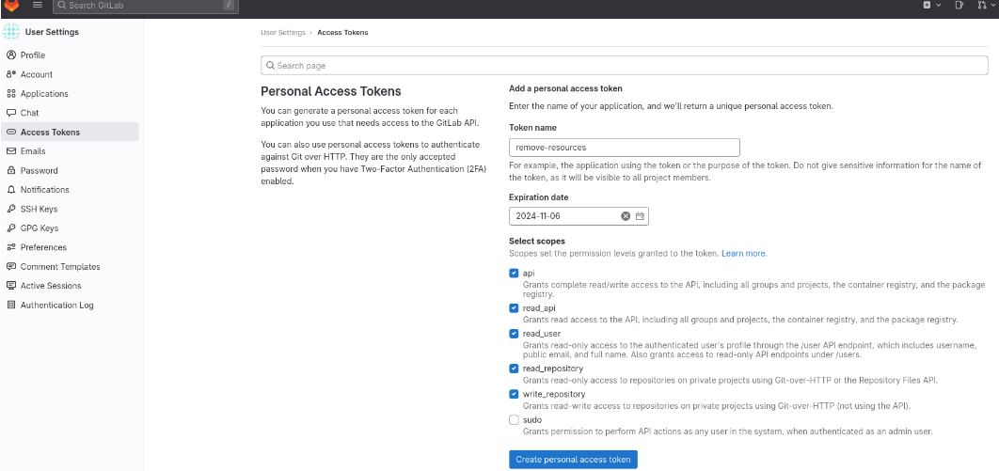
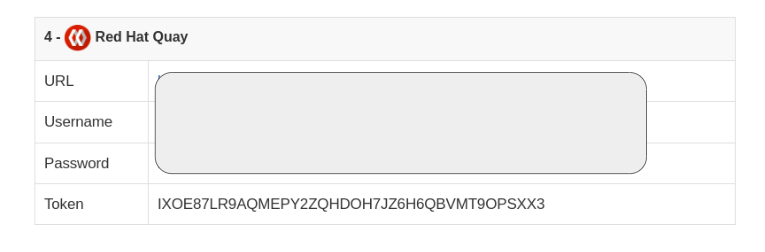
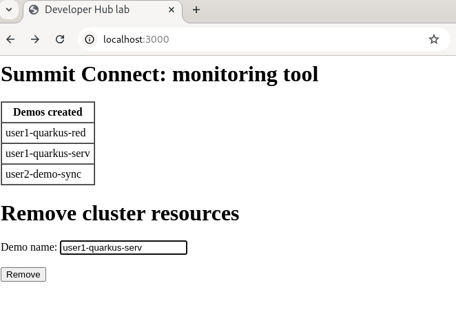
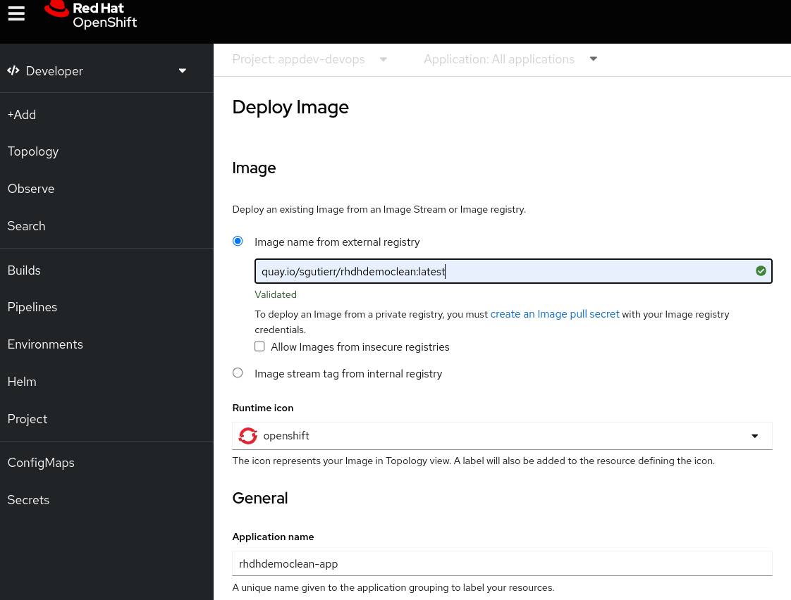
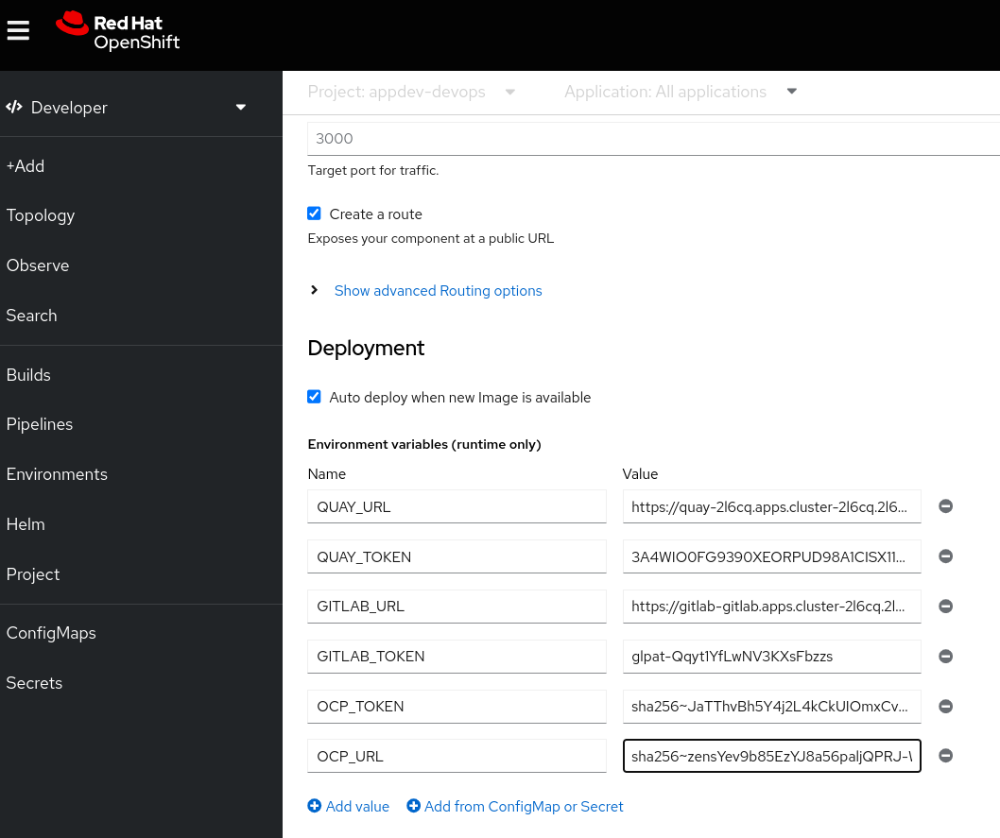

# Remove resources from developer hub demo environment

The aim of this application is keeping the resources of the OpenShift cluster under control, removing the following components created after running the "Quarkus Service with ArgoCD and a Tekton Pipeline" software template:
*   ArgoCd applications ("demo-name"-bootstrap)
*   Namespaces ("demo-name"-dev,"demo-name"-preprod,"demo-name"-prod)
*   Gitlab respositories ("demo-name","demo-name-gitops")
*   Quay images

There are 3 different deployment ways:
* Local
* Container
* OpenShift

Choose your preferred installation

# Instructions installation LOCAL:

## Prerequisites

Make sure you have oc (CLI), Node.js and npm installed.

## Install dependencies:

Install the node.js dependencies by running:

```console
npm install express body-parser axios
```

## Configure tokens and URLS with environment variables

These are the varaibles required:

```console
export QUAY_URL=https://quay-2l6cq.apps.cluster-2l6cq.2l6cq.sandbox919.opentlc.com/api/v1
export QUAY_TOKEN=3A4WIO0FG9390XEORPUD98A
export GITLAB_URL=https://gitlab-gitlab.apps.cluster-2l6cq.2l6cq.sandbox919.opentlc.com/api/v4
export GITLAB_TOKEN=glpat-Qqyt1Yf
export OCP_TOKEN=sha256~zensYev9b
```

### You can find your tokens as we show as follows:

*   GITLAB




*   QUAY



## Run application:

```console
node app.js
```

Open your browser and visit http://localhost:3000/. Add demo name and click on "Remove" button.



Note: Deleting resources is a destructive operation. Please ensure you fully understand the impact and have the necessary backups before running this code in a live environment.


# Installation in CONTAINER:

## Podman commands

```console
podman build -t node-app .
podman run -p 3000:3000 -d -e OCP_TOKEN=sha256~zensYev9b85EpaljQPRJ-Wvfo0M-T_zWvFlw -e OCP_URL=https://api.cluster-2l6cq.2l6cq.sandbox919.opentlc.com:6443 -e GITLAB_URL=https://gitlab-gitlab.apps.cluster-2l6cq.2l6cq.sandbox919.opentlc.com/api/v4 -e GITLAB_TOKEN=glpat-Qqyt1YfLwNVs -e QUAY_URL=https://quay-2l6cq.apps.cluster-2l6cq.2l6cq.sandbox919.opentlc.com/api/v1 -e QUAY_TOKEN=3A4WIO0FG9390XEORPUQ9M0EYVK6 node-app
```

# Installation in OpenShift:

OpenShift console -> Developer view -> Add -> Container Image



Adding environment variables



